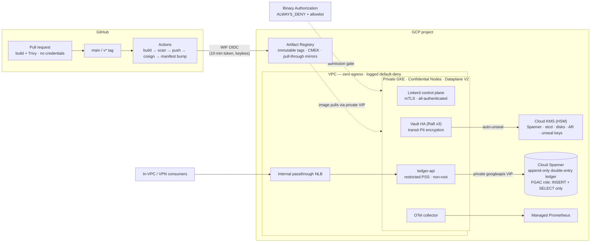

# GCP Financial Ledger — Zero-Trust Reference Architecture


Production-grade infrastructure-as-code for an **append-only, double-entry financial ledger** on Google Cloud.

The design goal: a workload that **cannot reach the internet**, **cannot mutate its own history**, **cannot run unapproved code**, and **holds no long-lived credentials anywhere** — enforced by infrastructure, not by convention or code review.

---

## Security posture at a glance

| Layer | Control |
|---|---|
| **Network** | No Cloud NAT, no public node IPs — the VPC has **zero internet egress**. All Google APIs ride the `private.googleapis.com` VIP (private DNS zones force it). Logged default-deny firewall in **both** directions, so blocked attempts leave audit evidence. |
| **Data** | Cloud Spanner encrypted with an **HSM-backed CMEK** (FIPS 140-2 L3). Append-only is enforced **twice, independently**: the database role `ledger_app` has `INSERT`+`SELECT` only (no `UPDATE`/`DELETE` exists to grant), and an **IAM condition** pins the workload identity to that one role. 7-day PITR + daily CMEK backups. |
| **Compute** | Private regional GKE. **Confidential Nodes (AMD SEV)** — memory encrypted *in use*. Shielded nodes, CMEK boot disks, CMEK etcd secrets, Dataplane V2 (eBPF NetworkPolicy). Pods see only the GKE metadata server — node credentials are unreachable. |
| **Admission** | **Binary Authorization `ALWAYS_DENY`** + an allowlist of exactly one project registry. Artifact Registry tags are **immutable**; third-party images (Vault, Linkerd, OTel) enter only through **pull-through mirror repos** — one supply-chain front door. |
| **Identity** | GKE Workload Identity for every pod; Workload Identity Federation for CI. **Zero exported service-account keys exist in this platform.** |
| **Mesh** | Linkerd mTLS with cluster-wide `defaultInboundPolicy: all-authenticated` — unauthenticated connections are denied by default. CNI plugin mode, so workload namespaces keep the `restricted` Pod Security level. Explicit per-identity `AuthorizationPolicy` — adding a consumer is a pull request. |
| **Secrets** | Vault HA (3-node Raft) with **GCP KMS auto-unseal** (dedicated HSM key, Vault's identity is its sole principal). Transit engine for field-level PII encryption. |
| **Supply chain** | PR builds get **no credentials at all** (WIF bindings admit only `main` and `v*` tags). Trivy gates CRITICAL/HIGH *before* push → immutable tag → **cosign keyless signature by digest** → automated manifest bump. SBOM (CycloneDX) on every build. |

---

## Architecture



**Traffic model:** the ledger is never internet-facing. Consumers reach it through an internal passthrough NLB (`externalTrafficPolicy: Local` preserves source IPs) or, if meshed, directly via the ClusterIP with per-request mTLS load-balancing. Two independent layers must both agree before a packet reaches the app: L3/L4 NetworkPolicy (Dataplane V2) and L7 Linkerd `AuthorizationPolicy`.

---

## Repository layout

```
.
├── .github/workflows/build-pipeline.yaml   # keyless CI: build → Trivy → push → cosign → bump
├── Dockerfile                              # multi-stage, static Go binary, UID 10001, read-only FS
├── terraform/
│   ├── providers.tf                        # GCS backend, API enablement, provider wiring
│   ├── variables.tf                        # inputs + validation + shared locals
│   ├── vpc-network.tf                      # zero-egress VPC, private googleapis DNS, logged deny-all
│   ├── cloud-spanner.tf                    # HSM CMEK, double-entry schema, FGAC grants, PITR + backups
│   ├── gke-cluster.tf                      # private GKE, Confidential Nodes, AR mirrors, Binary Authorization
│   ├── workload-identity.tf                # per-workload GSAs, IAM conditions, GitHub WIF
│   └── outputs.tf
├── kubernetes/
│   ├── infra/
│   │   ├── vault-config.yaml               # namespace + Helm values + policy bootstrap script
│   │   └── linkerd-values.yaml             # HA control plane, CNI mode, mirrored images
│   └── apps/ledger-api/
│       ├── deployment.yaml                 # ns, KSA, NetworkPolicies, Deployment, HPA, PDB
│       └── service.yaml                    # internal NLB + Linkerd Server/AuthorizationPolicy
└── monitoring/
    ├── collector-config.yaml               # OTel → Managed Prometheus (app, mesh, Vault)
    └── dashboard-metrics.json              # Cloud Monitoring dashboard (PromQL)
```

Every file carries a header documenting its design decisions and operational runbook — the "why", not just the "what".

---

## Prerequisites

- A GCP project with billing enabled (a **dedicated, disposable project is strongly recommended** — see [Cost & teardown](#cost--teardown))
- `terraform` ≥ 1.10, `gcloud`, `kubectl`, `helm`, `yq`
- [`step`](https://smallstep.com/cli/) CLI — one-time generation of the Linkerd trust anchor and issuer
- A GitHub repository (Actions enabled) if you want the CI pipeline live

All required GCP APIs are enabled declaratively by Terraform (`google_project_service.required`).

---

## Configuration

### Terraform inputs (`terraform/terraform.tfvars`)

```hcl
project_id = "your-project-id"

# Required unless enable_private_endpoint = true:
# never 0.0.0.0/0 for a financial platform.
master_authorized_networks = [
  { cidr_block = "203.0.113.0/24", display_name = "office-vpn" }
]

# Enables the keyless CI IAM (WIF pool, provider, CI service account).
github_repository = "your-org/your-repo"
```

Also set the state bucket name in `terraform/providers.tf` (`backend "gcs"` block).

### Placeholders in Kubernetes/monitoring manifests

The Terraform layer is fully variable-driven. The YAML/JSON layer uses two literal placeholders — substitute before applying (or wrap with `envsubst`/kustomize):

| Placeholder | Files | Replace with |
|---|---|---|
| `PROJECT_ID` | `vault-config.yaml`, `linkerd-values.yaml`, `deployment.yaml`, `collector-config.yaml` | Your GCP project ID |
| `REGION` | same files (image registry host, Vault `gcpckms` seal) | e.g. `us-central1` |
| `acme/ledger-platform` | `Dockerfile` label, cosign verify examples | Your `org/repo` |
| `ledger-production-keyring` | Vault seal stanza | Matches `${project_name}-${environment}-keyring` (default: unchanged) |
| `:v1.0.0` image tag | `deployment.yaml` | Managed by CI after the first build |

### GitHub repository variables (Settings → Variables)

| Variable | Source |
|---|---|
| `GCP_PROJECT_ID` | your project ID |
| `GCP_REGION` | e.g. `us-central1` |
| `GCP_WIF_PROVIDER` | `terraform output github_wif_provider` |
| `GCP_CI_SA` | `terraform output ci_service_account_email` |

If `main` is branch-protected, allow `github-actions[bot]` to push (the manifest-bump job commits to `main`), or swap the job to a GitHub App token.

---

## Deployment

**1. Remote state (once):**

```bash
gcloud storage buckets create gs://YOUR-STATE-BUCKET \
  --location=us-central1 --uniform-bucket-level-access \
  --public-access-prevention
gcloud storage buckets update gs://YOUR-STATE-BUCKET --versioning
```

**2. Provision the platform:**

```bash
cd terraform
terraform init
terraform plan
terraform apply
```

One apply builds the VPC, DNS, firewalls, KMS keys, Spanner (instance + schema + backups), GKE, node pool, Artifact Registry (+ mirrors), Binary Authorization policy, and all identity bindings.

**3. Cluster access:**

```bash
$(terraform output -raw kubeconfig_command)
```

**4. Linkerd** — generate the trust anchor and issuer offline, install CNI → CRDs → control plane, then `linkerd check`. The exact commands (including `step` cert generation and the `--set-file` wiring) are in the header of `kubernetes/infra/linkerd-values.yaml`. The trust anchor key goes to offline custody; only the issuer key touches the cluster.

**5. Vault** — apply the namespace + config, Helm-install with the image redirected to the AR mirror, `operator init` (recovery keys → offline custody; KMS auto-unseal means no unseal keys exist), join the Raft peers, run `bootstrap.sh`, and **revoke the root token**. Full runbook in the header of `kubernetes/infra/vault-config.yaml`.

**6. Application:**

```bash
# after substituting PROJECT_ID / REGION
kubectl apply -f kubernetes/apps/ledger-api/deployment.yaml
kubectl apply -f kubernetes/apps/ledger-api/service.yaml
```

**7. Monitoring** — deploy the OTel collector per the contract documented in `monitoring/collector-config.yaml` (namespace, KSA annotation, RBAC, NetworkPolicies), then:

```bash
gcloud monitoring dashboards create \
  --config-from-file=monitoring/dashboard-metrics.json
```

---

## CI/CD flow

```
PR        → hadolint → build → Trivy (CRITICAL/HIGH gate) → SBOM        [no credentials]
main / v* → all of the above → WIF token (10 min) → push immutable tag
            → cosign keyless sign (by digest) → bump image tag in manifest
```

The pipeline **never touches the cluster** — the control plane is unreachable from GitHub-hosted runners by design. Rollout is an operator (or in-VPC automation) applying the bumped manifest; Binary Authorization then admits the image only because it lives in the one allowlisted registry. Provenance is independently verifiable:

```bash
cosign verify REGION-docker.pkg.dev/PROJECT/images/ledger-api@sha256:... \
  --certificate-identity-regexp 'https://github.com/your-org/your-repo/.*' \
  --certificate-oidc-issuer https://token.actions.githubusercontent.com
```

---

## Design decisions

**Why enforce append-only in the database, not the application?** Application-level immutability survives exactly until the next bug or the next over-privileged credential. Here, `UPDATE`/`DELETE` on `Transactions`/`Entries` simply do not exist for the app's database role, and IAM conditionally forbids the workload from assuming any other role. Two independent control planes (Spanner FGAC + Cloud IAM) would both have to fail.

**Why zero egress instead of an egress proxy?** A proxy is an allowlist that grows. Removing the internet path entirely — and funneling every third-party artifact through Artifact Registry remote repositories — reduces the supply-chain surface to one auditable front door, and turns "did anything try to phone home?" into a firewall-log query.

**Why Linkerd over Istio?** The requirement is mTLS-by-default with explicit L7 authorization, at minimum operational weight. Linkerd's Rust micro-proxy, `all-authenticated` default inbound policy, and CNI mode (which keeps workloads on the `restricted` Pod Security standard) deliver that without an Envoy configuration surface this platform doesn't need.

**Why an internal passthrough NLB?** The ledger has no business on the internet. Passthrough + `externalTrafficPolicy: Local` preserves client source IPs, which lets both NetworkPolicy and Linkerd `NetworkAuthentication` reason about the *real* caller — the LB never becomes an identity-laundering hop.

**Why no GitOps agent (yet)?** With a private control plane and no runner access, CI-driven `kubectl` would mean punching holes in the perimeter. The bump-and-apply hand-off keeps the perimeter intact; an in-VPC Config Sync / Argo CD agent is the natural next step (see roadmap).

---

## Roadmap

- cert-manager for automated Linkerd issuer rotation (currently an operations duty with an 8760h horizon)
- In-cluster GitOps agent (Config Sync or Argo CD) pulling from `main`
- VPC Service Controls perimeter around Spanner, KMS, and Artifact Registry
- Multi-region Spanner (`nam3`) for a 99.999% SLA tier
- Alerting policies codified in Terraform (`google_monitoring_alert_policy`) on the dashboard's key series

---

## Cost & teardown

⚠️ **This stack is not free-tier.** The dominant costs are the Spanner production floor (1000 processing units, Enterprise edition), the regional GKE control plane, 3+ `n2d-standard-4` Confidential Nodes, HSM key versions, and full-sampling flow logs. Budget on the order of **four figures per month** if left running — deploy it to demo, then tear it down.

Teardown notes (guardrails are intentionally in your way):

- `deletion_protection = true` on the GKE cluster and Spanner database, plus `enable_drop_protection` on the database — flip these to `false` and apply before `terraform destroy`.
- KMS keys carry `prevent_destroy` and, per GCP semantics, **key rings and key names are permanent** (only key versions are destroyed).
- The cleanest teardown for a demo deployment is a **dedicated project + `gcloud projects delete`**.

Never commit `.terraform/`, state files, or `terraform.tfvars` — see `.gitignore`.

---

## License

MIT — see [`LICENSE`](LICENSE).
